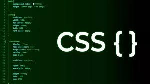

<h1 align="center"> Projeto Perfil </h1>

Resultado do curso oferecido pela Rocketseat  
<a href="https://lp.rocketseat.com.br/devlinks/inscricao?utm_source=github&utm_medium=descricao&utm_campaign=capture-devlinks&utm_term=organic&utm_content=descricao-github-mayk-brito">Acesse o curso de forma gratuita  clicando aqui.</a>

  <a href="#-tecnologias">Tecnologias</a>&nbsp;&nbsp;&nbsp;|&nbsp;&nbsp;&nbsp;
  <a href="#-sobre">Sobre</a>&nbsp;&nbsp;&nbsp;|&nbsp;&nbsp;&nbsp;

 

  

## Sobre

Esse foi meu primeiro projeto de desenvolvimento web, e foi através do curso gratuito Discover da Rocketseat que eu desenvolvi esse projeto.

Nunca tive muito interesse sobre esse assunto, mas esse curso me ajudou a ver o quão legal pode ser trabalhar com isso.

No futuro, quando estiver mais experiente, espero melhorar ele.

## Tecnologias

Esse projeto foi desenvolvido com as seguintes tecnologias:

- HTML e CSS
- JavaScript
- Git e Github
- Figma
